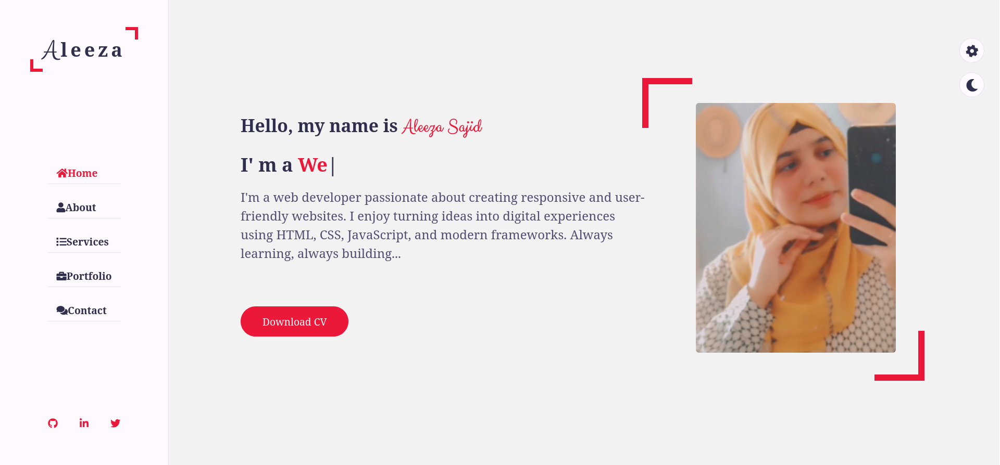
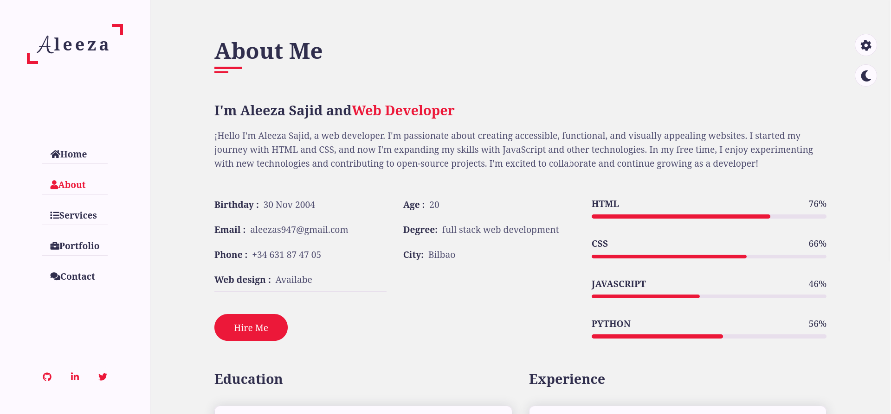
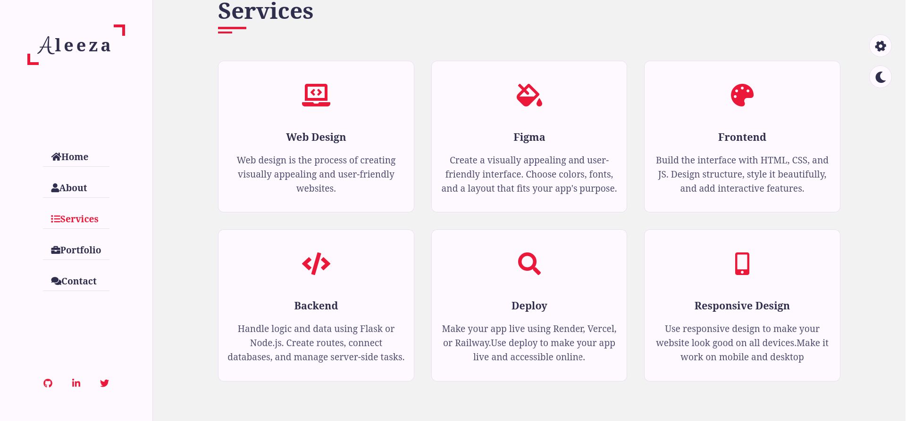
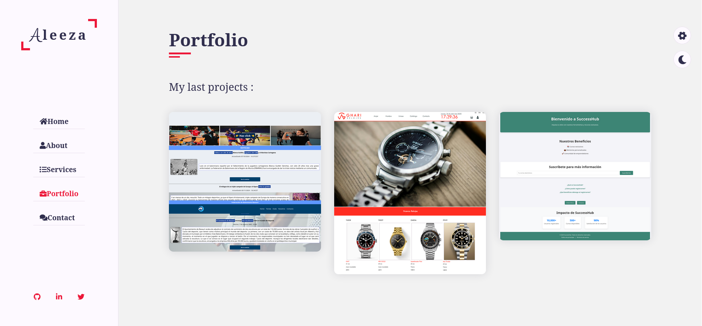
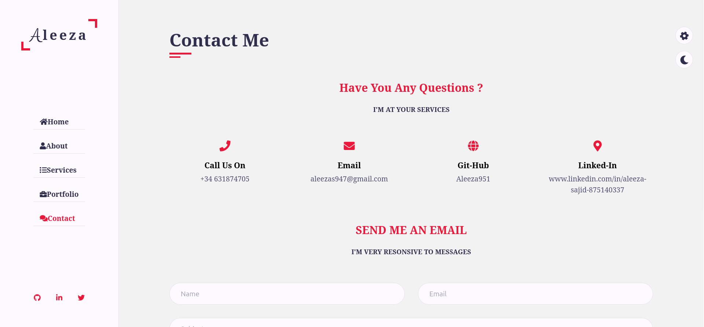
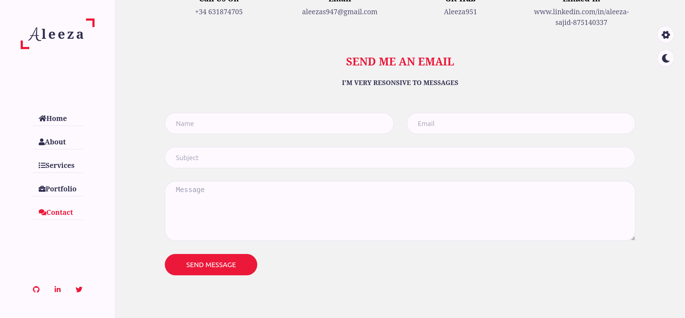
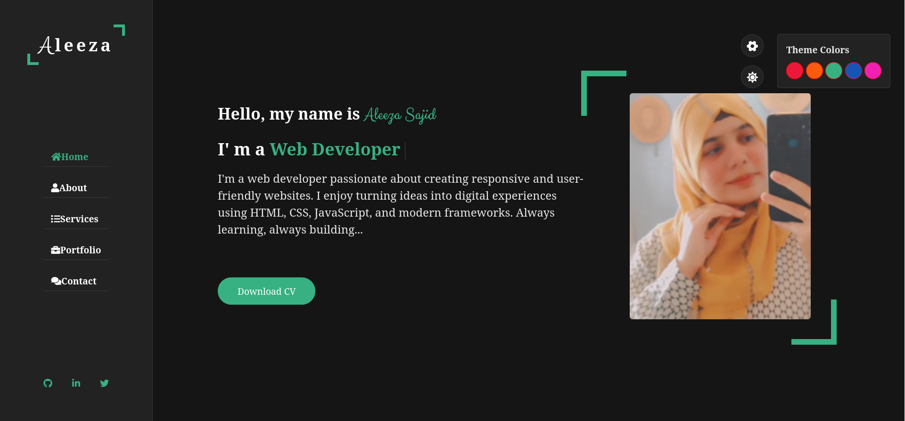
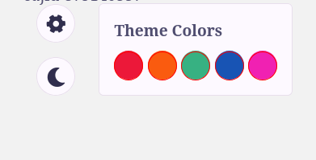

# Portfolio de ALEEZA SAJID 

¡Bienvenidos a mi portfolio! Este es un sitio web simple y elegante diseñado para mostrar mis habilidades como desarrolladora web. El diseño incluye una barra lateral de navegación, una página de inicio con mi foto e introducción, y secciones adicionales como Acerca de, Servicios, Portafolio y Contacto.



## Tabla de Contenidos

- [Introducción](#introducción)
- [Tecnologías Usadas](#tecnologías-usadas)
- [Cómo Ejecutar el Proyecto](#cómo-ejecutar-el-proyecto)
- [Acerca de](#acerca-de)
- [Servicios](#servicios)
- [Portafolio](#portafolio)
- [Contacto](#contacto)


## Introducción

Este es el portfolio de **Aleeza**, una desarrolladora web apasionada. He completado mi curso de desarrollo web y ahora muestro mis habilidades a través de este portfolio interactivo.

## Características

- **Navegación en la Barra Lateral:** Enlaces para Inicio, Acerca de, Servicios, Portafolio y Contacto.
- **Página de Inicio:** Incluye una foto y una breve introducción sobre mí.
- **Diseño Responsivo:** Este portfolio es responsivo y se ajusta a diferentes tamaños de pantalla.
- **Estilo CSS:** Diseño limpio y moderno con una disposición fácil de leer.

## Tecnologías Usadas

- **HTML5**
- **CSS3**
- **JavaScript**

## Cómo Ejecutar el Proyecto

Este proyecto no requiere dependencias adicionales ni servidor. Solo necesitas un navegador web para verlo.

### Pasos para ejecutar el proyecto:

1. **Clona el repositorio**:

   ```bash
   git clone https://github.com/Aleeza951/MI-PORTFOLIO-ALEEZA.git


Abre tu terminal y ejecuta el siguiente comando para clonar el proyecto

##### Accede a la carpeta del proyecto:

cd portfolio

##### Abre el archivo index.html en tu navegador:

    Doble clic en el archivo index.html.

    O usa un editor de código como Visual Studio Code con la extensión Live Server.

## Acerca de


### Mi Introducción

Hola, soy Aleeza, una desarrolladora web apasionada por crear experiencias web atractivas y funcionales. He completado mi curso de desarrollo web y tengo un gran interés en mejorar mis habilidades constantemente.

En esta sección muestro:

    Mis habilidades: un resumen con porcentajes sobre lo que sé (HTML, CSS, JavaScript, Python).

    Mi educación: detalles sobre el curso de desarrollo web que he completado.

    Mi experiencia: actualmente no tengo experiencia profesional, pero estoy en proceso de aprender y crecer como desarrolladora.

## Servicios



He añadido los siguientes servicios que ofrezco:

- Desarrollo Web  
- Desarrollo Frontend  
- Desarrollo Backend  
- Web Responsivas  
- Figma  
- Deploy


## Portafolio



En esta sección he añadido algunos de mis proyectos que he creado durante mi formación como desarrolladora web. Aquí puedes ver ejemplos reales de mi trabajo, diseño y desarrollo web.

## Contacto





En esta sección he añadido un formulario donde los usuarios pueden enviarme un mensaje directamente. El formulario incluye campos para el nombre, correo electrónico, asunto y mensaje.

## Funcionalidades

### Botones

He añadido dos botones interactivos en mi portfolio:

#### Descargar CV


Al hacer clic, se descarga automáticamente mi currículum en formato PDF.

#### Hire Me


Al hacer clic, el usuario es redirigido directamente a la página de contacto para enviarme un mensaje.


## Cambiar Tema de Color

He añadido una funcionalidad llamada colorTheme que permite cambiar el fondo del sitio web:



Cuando el usuario hace clic en el botón, el fondo cambia de blanco a oscuro, o de oscuro a blanco, según el estado actual.



He añadido una función llamada colorTheme que cambia solo el color de las palabras (como los encabezados) cuando el usuario hace clic en el botón:

No cambia el fondo, solo el color del texto (por ejemplo, los títulos y encabezados).

Permite al usuario personalizar la apariencia visual del texto según su preferencia.

### Menú Hamburguesa


He añadido un menú hamburguesa para dispositivos móviles:

Al hacer clic en el ícono de hamburguesa, se abre o cierra el menú de navegación lateral.

Esta función mejora la usabilidad en pantallas pequeñas y móviles.


## Gracias por visitar mi portfolio

Estoy emocionada por seguir creciendo como desarrolladora web.
¡No dudes en contactarme si quieres colaborar o tienes alguna pregunta! 🚀